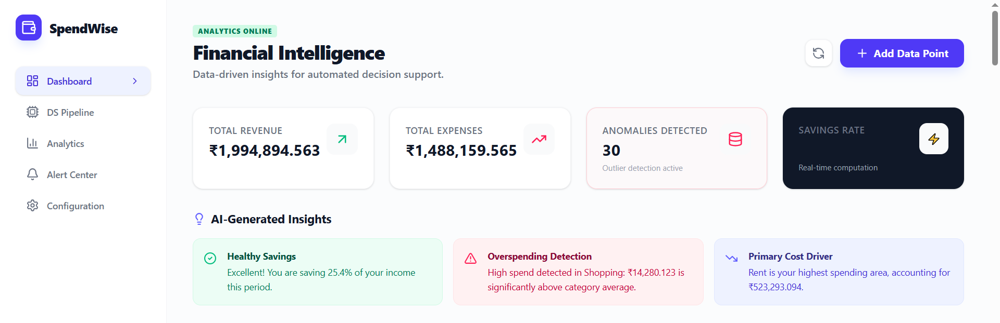
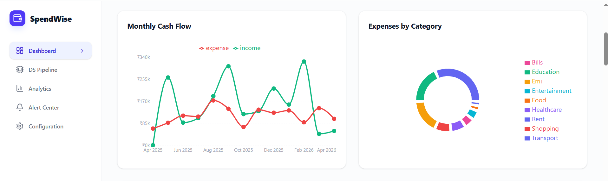
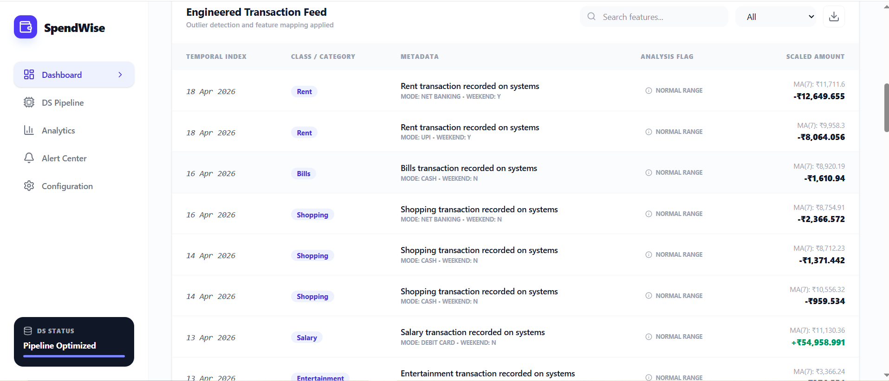

# 💰 SpendWise Analytics

## 📝 Project Overview
**SpendWise Analytics** is a financial analytics dashboard that simulates how expense tracking platforms process raw transaction data, generate spending insights, detect anomalies, and help users make better financial decisions.

The project demonstrates a complete analytics workflow including data simulation, preprocessing, feature engineering, KPI generation, anomaly detection, and dashboard visualization using React and TypeScript.

---

## 🎯 Business Problem
Manual expense tracking makes it difficult to identify overspending patterns and savings opportunities. This project demonstrates how financial analytics systems transform raw transactions into actionable insights through data processing and dashboard visualization.

---

## 🏗️ Data Pipeline Workflow
The system follows a structured analytical pipeline to ensure data integrity and actionable outputs:

**Raw Transactions** 
→ **Data Cleaning & Standardization** (Handling noise, whitespace, and type casting)
→ **Feature Engineering** (Calculating rolling averages, weekend flags, and temporal indices)
→ **KPI Aggregation** (Summarizing income, expenses, and savings rates)
→ **Anomaly Detection** (Threshold-based outlier identification)
→ **Dashboard Visualization** (Interactive charts for trend analysis)
→ **Automated Insights** (Decision-support summaries)

---

## 💡 Business Insights Generated
- **Anomaly Detection:** Detected unusually high spending when a transaction exceeded 1.5× the category average.
- **Cost Driver Analysis:** Identified the highest cost driver category across all processed expenses.
- **Financial Health Monitoring:** Calculated savings rate in real-time based on income vs expenses.
- **Trend Identification:** Generated rolling spending averages to monitor short-term expense trends and velocity.

---

## 🚀 Key Features
- **Data Simulation:** Simulates raw transaction data with inconsistent labels and noisy values to mimic real-world financial feeds.
- **Data Cleaning:** Automatically standardizes records and handles data type conversion before analysis.
- **Feature Engineering:** Computes rolling averages and weekend flags to add behavioral context.
- **Automated Anomaly Detection:** Flags overspending anomalies using robust threshold-based rules.
- **Real-time KPI Metrics:** Generates core financial indicators including total income, expenses, savings rate, and anomaly counts.
- **Interactive Dashboards:** Presents analysis through high-fidelity charts and specialized transaction tables.

---

## 🛠️ Tech Stack
- **Frontend/UI:** React 19, Tailwind CSS, Motion
- **Data Analysis Logic:** TypeScript ES2022
- **Data Visualization:** Recharts
- **Temporal Management:** date-fns

---

## 📸 Screenshots

### Dashboard Overview


### AI-Generated Insights


### Engineered Transaction Feed

---

## 🏁 How to Run
1. **Repository Setup:**
   ```bash
   git clone https://github.com/your-username/spendwise-analytics.git
   ```
2. **Install Analytical Core:**
   ```bash
   npm install
   ```
3. **Execute Pipeline:**
   ```bash
   npm run dev
   ```

---

## 🎙️ Interview Preparation
### How is overspending detected?
The application calculates the average spend for each category and flags any transaction that exceeds 1.5× that average as an anomaly.

### Why use rolling averages?
Rolling averages smooth short-term fluctuations and help identify recent spending trends more accurately.

### How does the pipeline handle inconsistent data?
We implement a cleaning layer that trims strings, standardizes category casing, and converts string-based currency values into numeric types for stable calculation.

---

## 💎 Why This Project Matters
Expense tracking systems are widely used in fintech platforms to help users understand spending behavior, identify anomalies, and improve savings decisions. This project simulates that workflow by combining data preprocessing, behavioral analysis, and dashboard reporting in a single analytics application.

---
**Financial Analytics | Data-Driven Decision Support**
